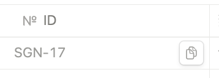

# Notion To Github PR Title

# モチベーション

PRのタイトルに[TASK-1]のようにいれるだけでnotionとGitHubを連携できる機能があるが、
IDをコピーして貼り付ける作業がめんどくさかったので、楽にしたかった。

あと、PRタイトルもタスク名とする事が多いので、その作業も楽にできたらということで作ってみた。

# 使うまでの下準備

もうインテグレーションの設定がされていたらAPIキーとDatabaseIDだけあれば使えるはず！

## 導入

### NotionとGitHubインテグレーションの設定がされていること

[https://www.notion.so/ja-jp/help/github](https://www.notion.so/ja-jp/help/github)

### NotionのAPIキーを持ってること

[https://www.notion.so/my-integrations](https://www.notion.so/my-integrations)

オーナー権限があればここから入手できるはず。なければ偉い人に聞いて下さい。

### 参照したいタスクのデータベースとインテグレーションが接続されていること

接続してなければ、データベースを開いて右上の「・・・」からコネクトで接続してね。

### Database IDを入手していること

databaseを開くとこんな感じのURLがでてくるのでそれを用意

https://www.notion.so/4f13a2e971ac4cec98cef9fb83599f64

# 仕様

- Databaseに「ID」が設定されていないと動作しません。カラム名も「ID」にする必要があります(今後は設定画面で入力できるようにするかも)

こんなの

- PRのタイトルとして使うDatabaseのカラム名は「タスク名」で固定(今後は設定画面で入力できるようにするかも)

- ブランチ名は「feature/SGN-1」とPrefix入力しなければ動作しない(今後Prefixは設定画面で入力できるようにするかも)
